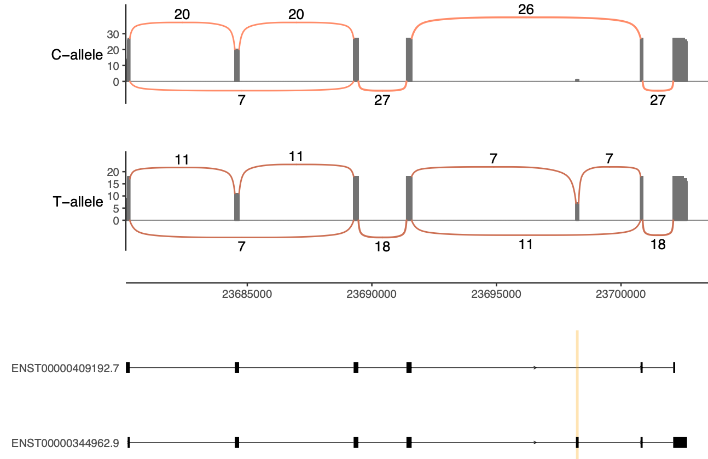

# **isoLASER**
[](https://test.pypi.org/project/isoLASER/)

[github](https://github.com/gxiaolab/isoLASER/)


## **About**

IsoLASER performs gene-level variant calls, phasing, and splicing linkage analysis using third-generation RNA sequencing data.

## **Table of contents**
- [Requirements](#requirements)
- [Installation](#installation)
- [Preprocessing](#preprocessing)
  - [Transcript identification](#transcript-identification)
  - [Annotate bam file](#annotate-bam-file)
  - [Extract exonic parts from GTF](#extract-exonic-parts-from-gtf)
- [Run IsoLASER](#run-isolaser)
- [Run IsoLASER joint](#run-isolaser-joint)
- [Make a nigiri plot](#make-a-nigiri-plot)
- [Demo](#demo)
- [Output](#output)
- [Debug](#debug)


## **Requirements**

IsoLASER is written in Python 3.8 and requires the following packages (with the tested versions):

- multiprocess
- numpy==1.24.4
- scipy==1.10.1        
- pandas==2.0.3
- pysam==0.16.0.1
- pytabix==0.1
- pyfaidx==0.5.8
- biopython==1.76
- vcfpy==1.0.3
- HTSeq==0.12.4
- networkx==3.1
- scikit-learn==1.3.2

IsoLASER has been tested in the following operating systems:
- CentOS Linux 7

External software requirements:
- [GATK](https://gatk.broadinstitute.org/hc/en-us) 
- [samtools](http://www.htslib.org/)
- [minimap2](https://github.com/lh3/minimap2)
- [tabix](http://www.htslib.org/doc/tabix.html)

## **Installation**

First, it is recommended to install IsoLASER in a virtual environment.

```
conda create -n isolaser_env python=3.8
```

You can clone this **GitHub** repository:
```
git clone git@github.com:gxiaolab/isoLASER.git 
cd isoLASER
python -m build
pip install .
```

Or you can install directly from **PyPI**:

```
pip install isolaser
```

Alternatively, you can also download the **Singularity** container:

```
singularity pull library://giovas/collection/s6
singularity exec s5_latest.sif isolaser
```

If successful, the program is ready to use. The installation incorporates console script entry points to directly call isoLASER:

```
isolaser --help
```

Installation time varies depending on the number of dependencies that need to be installed. 
Assuming all library dependencies are installed already, the installation of IsoLASER should only take a few seconds.  

## *Preprocessing* 

Long-read RNA sequencing is notorious for its high base-calling error rate. As such, it is important to clean and preprocess the data to discard false transcripts resulting from misalignment, bad consensus, truncation, and other technical artifacts.   


### Transcript identification

IsoLASER needs a GTF file as input to annotate individual reads with their isoform membership. Ideally, this GTF file is built using a long-read annotation software such as Talon, Clair, Bambu, Espresso, or similar. 

Details of the Talon pipeline can be found on their GitHub repository.[TALON](https://github.com/mortazavilab/TALON).

- The pipeline consists of correcting alignments around splice junctions using `TranscriptClean`, and labeling the reads for internal priming using `talon_label_reads`. 
- The processed bam files are then ready to be annotated by first creating a database with `talon_initialize_database` and then annotating the individual reads with `talon`. 
- Finally, the transcripts are filtered with `talon_filter_transcripts` and a GTF file is constructed with the retained transcripts with the command `talon_create_GTF`.     


### Annotate bam file

From the annotation used in the previous step, use the GTF file to generate a transcriptome reference for alignment.   
This step serves to assign transcript ids to every read of the target bam file.

```
# generate transcriptome reference from GTF
isolaser_convert_gtf_to_fasta -g {annot.gtf} -f {reference.fa} -o {transcriptome}

# convert bam file to fastq for re-alignment
samtools fastq {input.bam} > {input.fq}

# re-align against newly generated transcriptome reference
minimap2 -t 16 -ax splice:hq -uf --MD {transcriptome.fa} {input.fq} > {transcriptome.sam}
```

The output is a sam file where the contigs are transcript ids. 
Next, filter for secondary, supplementary and trans-gene reads whilst annotating with transcript ids. 

```
isolaser_filter_and_annotate -b {input.bam} -t {transcriptome.sam} -g {annot.gtf} -o {input.annot}
```
The output is a bam file: `input.annot.bam` after some basic filtering (secondary and supplemental reads), trans-gene filtering and the `ZG` and `ZT` tags with the name of the corresponding gene and transcript id for each read.  

### Extract exonic parts from GTF

IsoLASER uses an exon-centric approach to analyze splicing and exonic-parts are a great granular approach to understand local splicing changes. 

```
isolaser_extract_exonic_parts -g {annot.gtf} -o {transcript.db}
```

The output is a new directory `transcript.db` that contains a pickle file per gene encapsulating all the exonic parts and transcripts associated with them.   

## *Run IsoLASER*

IsoLASER requires the annotated bam file (with ZG and ZT tags), the transcriptome database with exonic parts, and a reference annotation (e.g. hg38.fa).  

```
isolaser -b {input.annot.bam} -o {output.prefix} -t {transcript.db} -f {reference.fa}

# output:
{output.prefix}.vcf
{output.prefix}.mi_summary.tsv
```

The output is very extensive and includes information that is only relevant for the joint analysis or plotting. 
To obtain the significant allele-specific events (cis-directed splicing events) use the filter function: 

```
isolaser_filter -m {output.prefix.mi_summary.tsv} -o {output.prefix.mi_summary.filtered.tsv}
```

## *Run IsoLASER joint*

The first step is a wrapper of GATK functions to merge the variant calls from different samples.

The input file `fofn` contains informaiton of the individual samples
```
# fofn.tsv
SM1 SM1.bam SM1.mi_summary.tsv
SM2 SM2.bam SM2.mi_summary.tsv
```
Run the combine vcf step:
```
isolaser_combine_vcf -f {fofn.tsv} -o {output.prefix}

# output:
{output.prefix}.combined.vcf
{output.prefix}.genotyped.vcf
```
Perform joint analysis
```
isolaser_joint -f {fofn.tsv} -o {output.prefix} -t {transcript.db}

# output:
{output.prefix}.merged.mi_summary.tsv
```

## *Make a nigiri plot*

Parse the `.mi_summary.tsv` file to obtain the list of events to plot

```
nigiri_parse --mi {output.prefix.mi_summary.tsv} -o {output.plot} -t {transcriptome.db} 

# output:
{output.plot}.cis_events.bed
{output.plot}.cis_genes.tsv
```
Split the bam file

```
nigiri_split -b {input.annot.bam} -v {var.string} -o {fofn} 
```
We use an adapted version of [ggsashimi](https://github.com/guigolab/ggsashimi)
```
nigiri_plot -b {fofn} -c {region} -o {output.plot} 
```



## **Demo**

For a complete demo please check the [test_pipeline](test_pipeline) repository.

## **Debug**
If you experience any issues please submit your question to the *Issues* tab on this website. 


