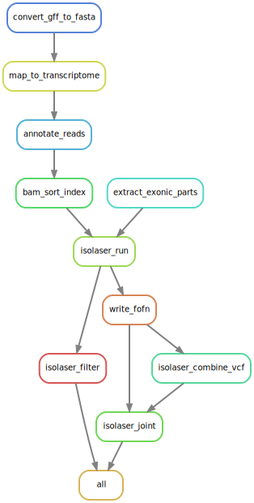
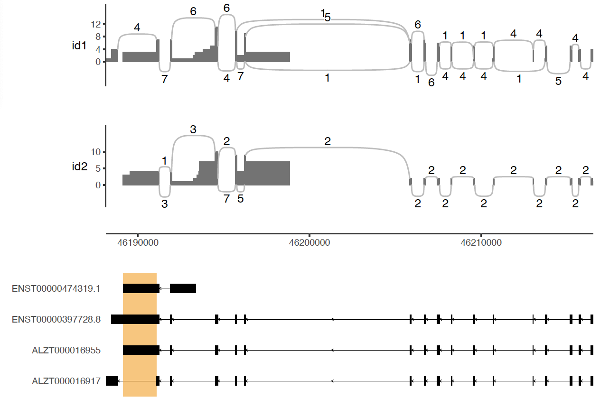

# **Walk through example**

## Data

3 long-read RNA-seq samples extracted from the Dorsolateral prefrontal cortex tissue from 3 patients.
We subsetted reads mapping to chr21 only. 

## Snakemake 

The following command should run the entire pipeline:

```
snakemake -s isolaser_test.smk --cores 4
```

On a regular computer, this should take less than 5 minutes.



## Plot

Parse cis-directed events

```
nigiri_parse
  --mi out/isolaser.dlpfc_2.mi_summary.tab.gz
  -o nigiri/dlpfc_2
  -t data/talon_observedOnly_db
```

Split bam file by alleles

```
nigiri_split
  -b bam/dlpfc_2.annotated.bam
  -v "chr21:46194528:A>G"
  -o nigiri/dlpfc_2.gene_LSS.fof
```

Plot

```
nigiri_plot
  -b nigiri/dlpfc_2.gene_LSS.fofn
  --mi nigiri/dlpfc_2.cis_events.bed
  -g data/talon_observedOnly.chr21.sorted.gz
  -c "chr21:46188140-46216524"
  -o nigiri/dlpfc_2.gene_LSS.pdf
```


